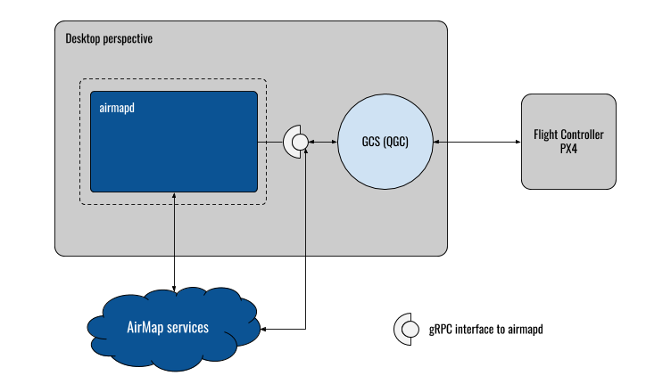
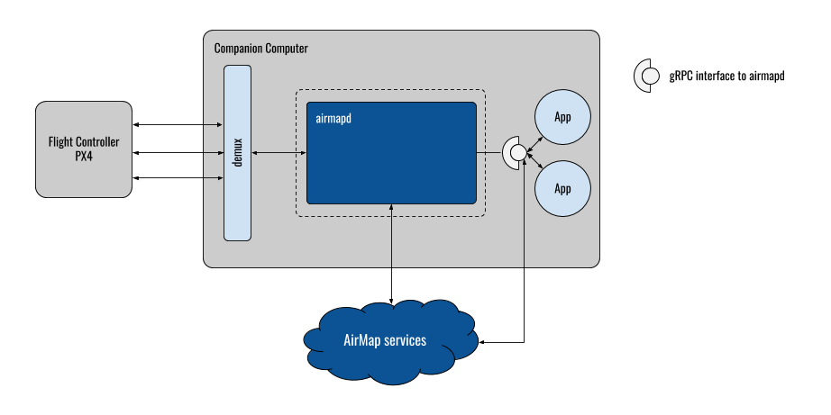

# airmapd [](https://cici-us-west-2a.airmap.io/gh/airmap/airmapd)

`airmapd` is the representation of AirMap's services on the client side, ranging from desktop machines running a ground-control station to drones featuring a companion computer. From a high-level point of view, `airmapd`
 - exposes the AirMap services to client applications
 - constitutes a representation of AirMap on drones, taking on mission control and data acquisition tasks
The following diagrams illustrate both perspectives:




This project has two main deliverables:
 - the executable `airmap` featuring a `git`-like layout of subcommands
 - the shared library `libairmap` (with a platform-specific suffix)

## Source Code Layout

The public facing API of `airmapd` can be found in `${AIRMAPD_ROOT}/include/airmap`. At this point in time, the interface
structure closely resembles the current ReST API exposed by AirMap. Going forward, the client-facing API will change, though,
and expose higher-level concepts.

The implementation is structured as followed:
 - `src/airmap`: General implementation, most importantly:
   - `${AIRMAPD_ROOT}/src/airmap/daemon.h` and `${AIRMAPD_ROOT}/src/airmap/daemon.cpp` implementing `airmapd`
 - `src/airmap/cmds`: Command-line executables
 - `src/airmap/codec`: Encoding and decoding of core data types and structures into different formats
 - `src/airmap/mavlink`: MavLink-specific for reading and writing MavLink-messages over arbitrary transports
 - `src/airmap/platform`: Platform-specific interfaces and implementations go here
 - `src/airmap/rest`: An implementation of the public-facing API, using the existing ReST-APIs exposed by AirMap
 - `src/airmap/util`: Utility classes and helpers

## Development Workflow

`airmapd` uses CMake for building and testing. We envision the following development workflow:
```
# Clone airmapd and all its dependencies
git clone --recursive github.com/airmap/airmapd
# Please execute these commands at the root of the source tree
mkdir build
cd build && cmake .. && make
# Do some changes, iterate, be happy, get ready to issue a PR
make format
```

## Setup & Dependencies:

Please refer to the platform-specific `setup*.sh` scripts in the `tools/${PLATFORM}` subfolder. For Ubuntu, and under the assumption of `docker` being available,
you can bootstrap a development environment in a `docker` container with:
```
docker run -v $(PWD):/airmapd -it ubuntu:17.04 bash
tools/ubuntu/setup.dev.sh
```

## Configuration

The main configuration of the `airmap` executable lives in the file `~/.config/airmap/${AIRMAP_SERVICE_VERSION}/config.json` (on UNIX-like platforms, including macOS). The file has the following structure:
```
{
    "host": "api.airmap.com",
    "version": "production",
    "sso": {
      "host": "sso.airmap.io",
      "port": 443
    },
    "telemetry": {
      "host": "api-udp-telemetry.airmap.com",
      "port": 16060
    },
    "traffic": {
      "host": "mqtt-prod.airmap.io",
      "port": 8883
    },
    "credentials": {
      "api-key": "your api key should go here",
      "oauth": {
        "client-id": "your client id should go here",
        "device-id": "your device id should go here, or generate one with uuid-gen",
        "username": "your AirMap username should go here",
        "password": "your AirMap password should go here"
      }
    }
  }
```
Users should replace `${AIRMAP_SERVICE_VERSION}` with `production`.

## Running `airmapd` on Intel Aero

Please refer to https://airmap.atlassian.net/wiki/spaces/AIRMAP/pages/69992501/Intel+Aero for Intel Aero setup instructions.

Please note that these instructions only apply to Intel Aero images featuring `systemd`.
This is the case if you are using the latest Intel Aero image (1.5.1 at the time of this writing).

We rely on `docker` to deliver `airmapd` to the Intel Aero. For that, you first need to buid a docker container with the
following command line:
```
tools/alpine/build-docker-image.sh
```
Once the command finishes, you should save the container to a tarball by running:
```
docker save -o airmapd.tar.gz airmapd:latest
```
Copy the resulting `airmapd.tar.gz` to a USB stick, and mount the stick on the Intel Aero.
Restore the image on the Intel Aero by running:
```
docker load -i airmapd.tar.gz
```
Once the image is loaded, create the file `/lib/systemd/system/airmapd.service` with the following contents:
```
[Unit]
Description=The AirMap on-vehicle service

[Service]
ExecStart=/usr/bin/docker run \
  -v ~/.config/airmap:/root/.config \
  airmapd:latest \
    --aircraft-id=${AIRMAPD_AIRCRAFT_ID}\
    --telemetry-host=api.k8s.stage.airmap.com\
    --telemetry-port=32003\
    --tcp-endpoint-ip=172.17.0.1\
    --tcp-endpoint-port=5760

[Install]
WantedBy=multi-user.target
```
Create the file `~/.config/airmap/production/config.json` following the description of its format given before.
Run `systemctl daemon-reload && systemctl enable airmapd` and reboot the vehicle. Check the output of the service with:
```
journalctl -f -u airmapd
```

### Missing `/etc/resolv.conf`

Depending on your setup and signal coverage, the `airmapd` service might start before `NetworkManager` succeeds in creating
a connection via the LTE modem. In this case, `/etc/resolv.conf` is missing and you might run into a known [docker issue](https://github.com/docker/libnetwork/pull/1847). Please wait for the LTE connection to be established and run `systemctl restart airmapd`.
