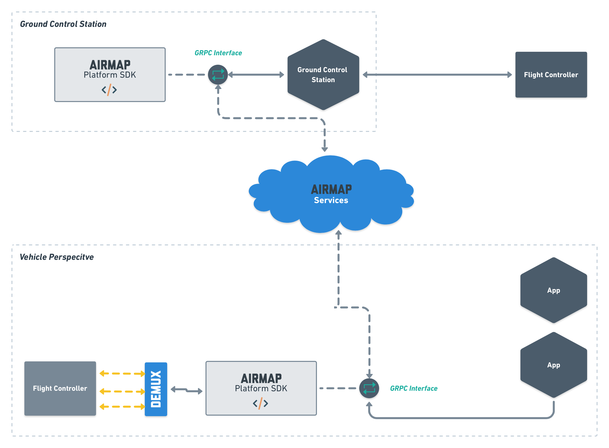

# AirMap Platform SDK

<!-- [  ](https://cici-us-west-2a.airmap.io/gh/airmap/airmapd)-->


The `AirMap Platform SDK` is the representation of AirMap's services on the client side, ranging from desktop machines running a ground-control station to drones featuring a companion computer. From a high-level point of view, The `AirMap Platform SDK`

 - exposes the AirMap services to client applications
 - constitutes a representation of AirMap on drones, taking on mission control and data acquisition tasks

The following diagram illustrate both perspectives:



This project has two main deliverables:

 - the executable `airmap` featuring a `git`-like layout of subcommands
 - the shared library `libairmap` (with a platform-specific suffix)

## Integration With Other Projects

This section describes the steps to integrate and use the AirMap Platform SDK in the scope of another project, e.g., a mission planner.
Please note that our primary development and deployment targets are Linux and MacOS at this point in time. We are actively working on builds for:

 * MS Windows
 * iOS
 * Android

The following steps provide you with a set of libraries and headers ready for consumption in your project:
 * Install build dependencies following the guidelines in section 'Setup & Dependencies'
 * Clone the `airmap-platform-sdk` repo: `git clone https://github.com/airmap/platform-sdk.git`
 * Build & install the `AirMap Platform SDK`: `mkdir build && cd build && cmake -DCMAKE_INSTALL_PREFIX=/choose/the/install/path .. && make && make doc && make install`
 * Find the API documentation in `build/doc/html/index.html`

Adjust the build configuration of your project:
   * Add `/choose/the/install/path/include` to your include paths
   * Add `/choose/the/install/path/lib/${ARCHITECTURE_TRIPLET_IF_REQUIRED}/{libairmap-qt.*.so,libairmap-cpp.*.so}` to your linker configuration
     * Note that you only need to add `libairmap-qt.*.so` if you intend to consume the qt-specific functionality in `include/airmap/qt`

Pull in `airmap` services and functionality following the examples given in:
  * `examples/qt/client.cpp`: Illustrates use of the Qt binding layer
  * `src/airmap/cmds/airmap/cmd/simulate_scenario.{h,cpp}`: Illustrates the complete flow of:
    * authenticating with AirMap
    * creating a flight
    * querying flight status
    * starting the flight and telemetry submission
    * submitting telemetry and receiving traffic information
    * stopping and properly ending the flight

## Source Code Layout

The public facing API of the `AirMap Platform SDK` can be found in `${AIRMAPD_ROOT}/include/airmap`. At this point in time, the interface
structure closely resembles the current ReST API exposed by AirMap. Going forward, the client-facing API will change, though,
and expose higher-level concepts.

The implementation is structured as followed:
 - `src/airmap`: General implementation, most importantly:
   - `${AIRMAPD_ROOT}/src/airmap/daemon.h` and `${AIRMAPD_ROOT}/src/airmap/daemon.cpp` implementing the `AirMap Platform SDK`
 - `src/airmap/boost`: Point-of-entry to the boost-based implementation of core platform components
 - `src/airmap/cmds`: Command-line executables
 - `src/airmap/codec`: Encoding and decoding of core data types and structures into different formats
 - `src/airmap/net`: Network-specific infrastructure goes here
 - `src/airmap/mavlink`: MavLink-specific for reading and writing MavLink-messages over arbitrary transports
 - `src/airmap/platform`: Platform-specific interfaces and implementations go here
 - `src/airmap/rest`: An implementation of the public-facing API, using the existing ReST-APIs exposed by AirMap
 - `src/airmap/util`: Utility classes and helpers

## Development Workflow

The `AirMap Platform SDK` uses CMake for building and testing. We envision the following development workflow:

```# Clone airmapd and all its dependencies
git clone --recursive https://github.com/airmap/platform-sdk.git
# Update Submodules
cd platform-sdk && git submodule update --init --recursive
# Please execute these commands at the root of the source tree (DON'T FOLLOW the commands below if you intend to build the AirMap Platform SDK in Ubuntu/Docker)
mkdir build
cd build && cmake .. && make
# Do some changes, iterate, be happy, get ready to issue a PR
make format
```

## Setup & Dependencies:

### Ubuntu
Run the following commands from the top-level the `AirMap Platform SDK` folder:

```
tools/ubuntu/setup.dev.sh
mkdir build
cd build
cmake ..
make
```

### Docker with Ubuntu
Make sure that you start with a clean environment (fresh clone of the AirMap Platform SDK and no attempts to build outside of docker)
Run the following commands from the top-level `airmapd` folder:

```
docker run -v $(pwd):/airmapd -w /airmapd -it ubuntu:18.04 bash
tools/ubuntu/setup.dev.sh
mkdir build
cd build
cmake ..
make
```

### Raspberry Pi
We provide the `AirMap Platform SDK` as a docker image to the Raspberry Pi. Building the docker container requires a linux host as we rely on `qemu` to cross-build on x86 machines. Run the following commands from the top-level `AirMap Platform SDK` folder:
```
tools/rpi/build-docker-image.sh
```

### macOS - homebrew
Run the following commands:
```
brew tap airmap/airmapd https://github.com/airmap/platform-sdk.git
brew install airmapd
```
Please note that the recent updates to macOS and XCode (in 9.2017) break the cmake brew formula in version 3.9.3 (see https://gitlab.kitware.com/cmake/cmake/issues/17101 for the details). Please downgrade your brew cmake installation to 3.9.2 or 3.9.1 (whichever is available). This can be accomplished with `brew switch`.
```
brew list --versions cmake
brew switch cmake 3.9.1
```

### macOS - Build Manually
Run the following commands from the top-level the `AirMap Platform SDK` folder:
```
tools/osx/setup.sh
mkdir build
cd build
cmake ..
make
```

## Configuration

The main configuration of the `airmap` executable lives in the file `~/.config/airmap/${AIRMAP_SERVICE_VERSION}/config.json` (on UNIX-like platforms, including macOS). The file has the following structure:
```
{
  "host": "api.airmap.com",
  "version": "production",
  "sso": {
    "host": "sso.airmap.io",
    "port": 443
  },
  "telemetry": {
    "host": "api-udp-telemetry.airmap.com",
    "port": 16060
  },
  "traffic": {
    "host": "mqtt-prod.airmap.io",
    "port": 8883
  },
  "credentials": {
    "api-key": "your api key should go here",
    "oauth": {
      "client-id": "your client id should go here",
      "device-id": "your device id should go here, or generate one with uuid-gen",
      "username": "your AirMap username should go here",
      "password": "your AirMap password should go here"
    }
  }
}
```
Bootstrap a configuration by running:
```
airmap init
```
If you have a default text editor configured (e.g., by setting $VISUAL or $EDITOR), the configuration file will be opened for editing for you. If not, you need to open the file `~/.config/airmap/production/config.json` in your favorite editor and fill in your actual credentials for accessing the AirMap services.

## Authentication
Authenticate with the AirMap services by running:
```
airmap login
```
This will place the resulting token into `~/.config/airmap/production/token.json`.
If you have a proper AirMap account and authenticated previously, you can renew your authentication token by running:
```
airmap login --renew=true
```
